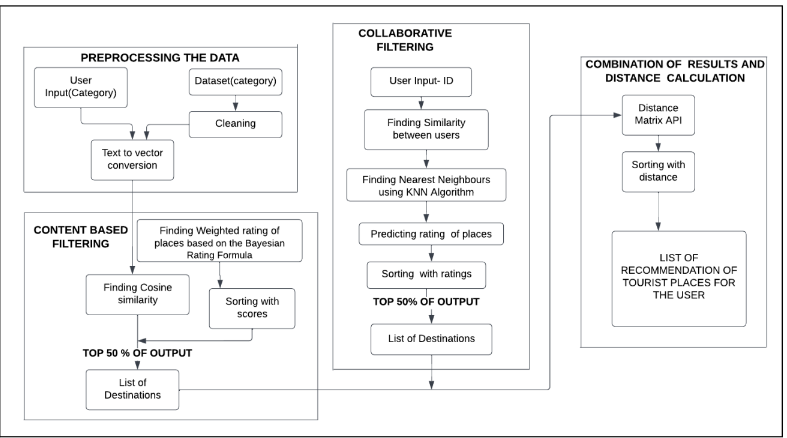

# Tour Recommendation System - Hybrid Approach

## Project Overview

This project implements a hybrid approach of tour recommendation system that combines content-based and collaborative filtering techniques to provide personalized recommendations for tourist places.

### Block Diagram:

## Approach

### Content-Based Filtering
- **Cosine Similarity:** Similarity between places is computed using cosine similarity.
- **Weighted Rating Calculation:** Using Bayesian rating formula weighted rating score for the places are calculated. 
- **Sorting:** Places are sorted according to their scores.

### Collaborative Filtering
- **User Similarity:** Similarity between users is calculated using their IDs.
- **KNN Algorithm:** Nearest neighbors are identified using the KNN algorithm.
- **Rating Prediction:** Ratings for places are predicted and sorted based on these predictions.

### Hybrid Recommendation
- **Combination of Methods:** Results from both content-based and collaborative filtering are combined.
- **Distance Matrix API:** The combined recommendations are processed through the Distance Matrix API to sort places by distance.

## Results
- **Top Recommendations:** The system provides a top list of recommended tourist places, sorted by distance for the user.
